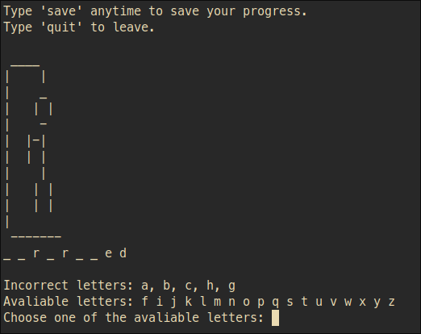

# Hangman
This project is a simple command-line version of the classic word-guessing game, Hangman. It offers an enjoyable and interactive experience for users to challenge themselves with word puzzles.

This project is based on the Hangman Assignment from [The Odin Project curriculum](https://www.theodinproject.com/).

# Skills
### After making it I learned:
- Better OOP in ruby
- File Handling with YAML
# Tech
### This project was made with:
[Ruby]

